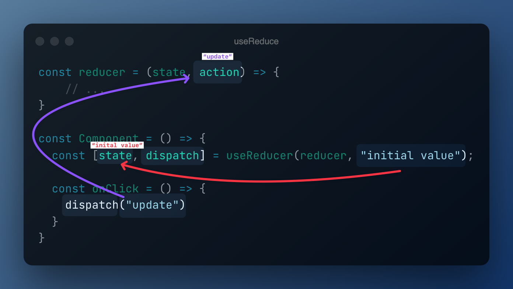

# use reducer

Voici un hooks totalement sous-coté.

Dans cette exercise on va utiliser **toutes la puissance**. Il faut savoir que quand
j'ai appris React c'est celui qui ma pausé le plus problème. Je vais essayé
de rendre son concept le plus simple possible.

[📖 Doc de useReducer](https://beta.reactjs.org/apis/usereducer)



_J'explique ce flow dans la vidéo d'intro._

> C'est quoi la différence avec useState ?

Enfaite useState est une version limité de useReducer, regarde :

(en acceptant que `initalValue` ne soit pas une fonction)
```js
const reducer = (prevValue, newValue) => {
  // On peut aussi passé une fonction dans le `setState`
  if (typeof newValue === "function") {
    return newValue(prevValue);
  }
  return newValue;
}

const useState = (initalValue) => {
  const [state, setState] = React.useReducer(reducer, initalValue);
  return [state, setState]
}
```

Donc finalement ce reduce est une sorte de `super useState` pour
réaliser tout tes rêves et tes désirs.

## Exercise 1

Nous avons un counter qui ne fonctionne pas pour l'instant, fait
le fonctionner.
Quand tu clique sur le compteur, il doit s'incrémenter de 1.

💌 Tu apprends l'usage le plus basique du `useReducer`.

## Exercise 2 - Bouton moins !

Maintenant ajoute un deuxième button : le button moins !

Quand tu clique dessus, il doit décrémenter de 1.

🦁 Tu vas devoir modifier la fonction `reducer` pour qu'elle
s'adapte à l'action qui est passé en paramètre.
💡
```js
switch(action) {
  case "increment":
    // ...
  case "decrement":
    // ... 
  default:
    // ...
}
```

## Exercise 3 - Refactor et reset

Pour cette exercise 3 choses :

1. Ajoute un button `reset` avec une nouvelle action : `reset` qui reset le compteur à 0.
2. Crée une constantes qui contient chaque Action (`increment`, `decrement`, `reset`) et utilise ces constantes aulieu de string

💡
```js
const Actions = {
  INCREMENT: "increment",
}
```

💌 Tu apprends à ajouté des actions qui ne se base par sur la valeur du state.
💌 Tu apprends à refactor ton code pour éviter des problèmes.

PS : TypeScript résoue bien mieux se problème.

## Exercise 4 - De 5 en 5 !

Ajoute deux nouveaux boutons :
- `+5` qui increment de **5**
- `-5` qui decrement de **5**

Pour ça il ne faut pas rajoutés de nouvelles actions, mais plutôt ajouté
une paramètre à notre action.

💡
```js
const reducer = (value, {action, value}) => {/*...*/}
```

💌 Tu apprends à ajouter 1 paramètre dans l'action.

## Bonus

Tu veux aller encore plus loins ?

Tu peux rajouter un input pour `set` la value, avec une action set.